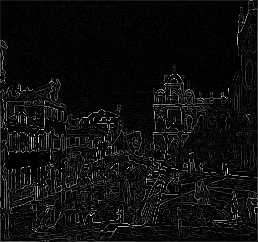

# Canny Edge Detection
This repository is created for a course project and not intended for public use. However, feel free to use it for any kind of applications if you find it useful.

## Program needs:
* Image (binary format) file location
* Standart deviation value for the Gaussian filter.

## Outputs:
* Result of the canny edge detection algorithm into:            Result.raw
* Result of edge detection without non-maximum supression into:	sobelIntensity.raw
* Result of Sobel x filter into:                       					sobelX.raw
* Result of Sobel y filter into:                      					sobelY.raw
* Result of the Gaussian blurring into:                 				blurred.raw

## Example
input1: images\\cana.raw

input2: 1.5

<b>Raw Image</b>

<b>Result Image</b>

